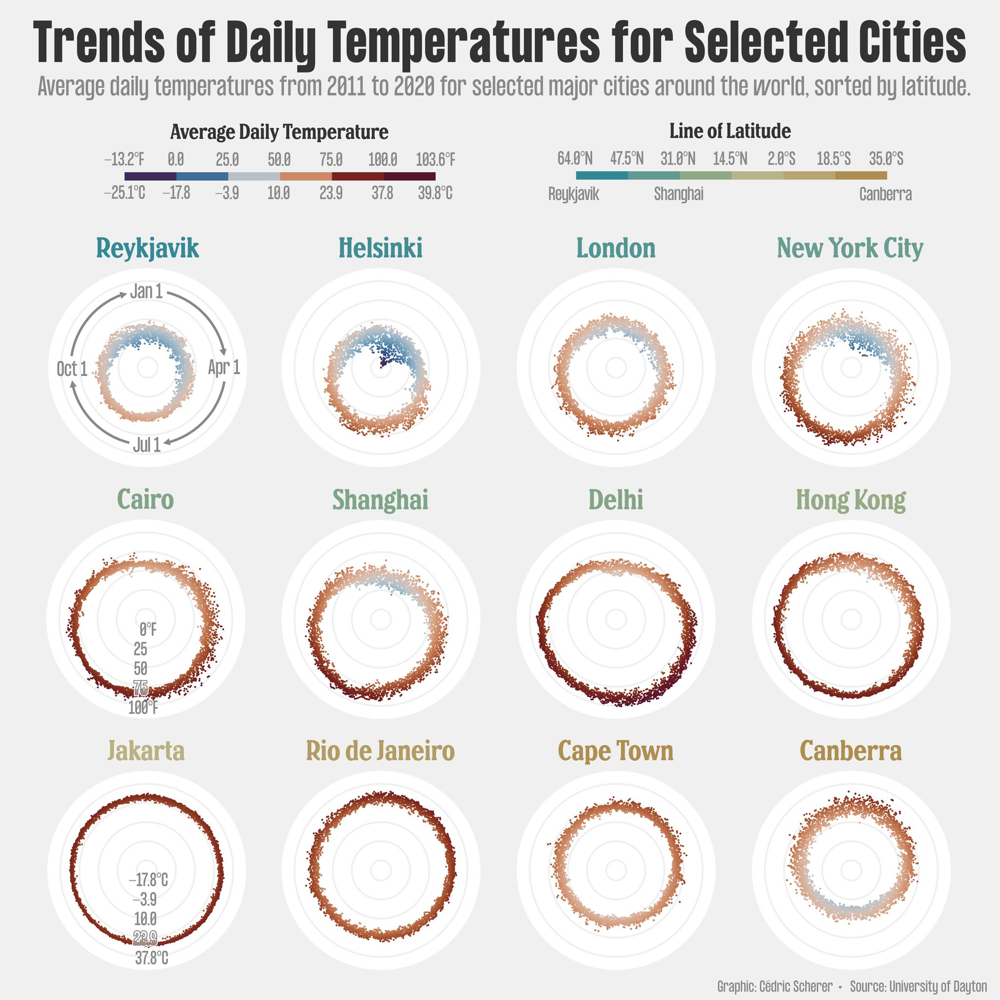
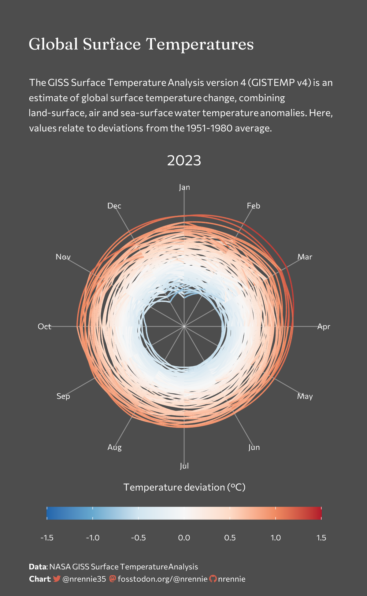
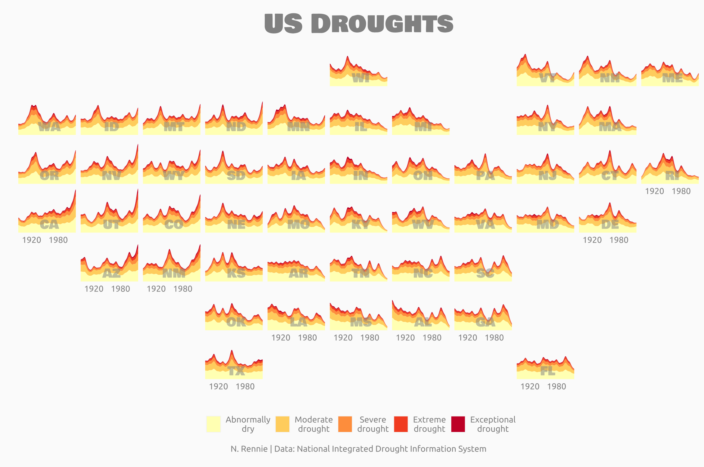
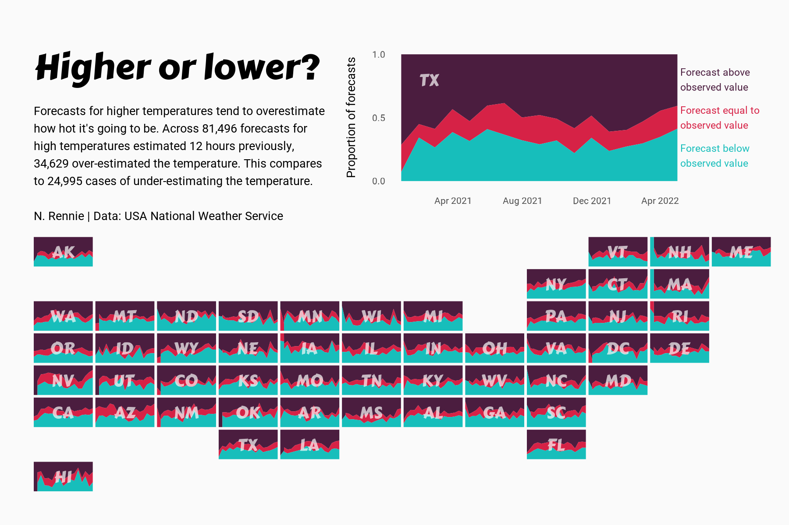
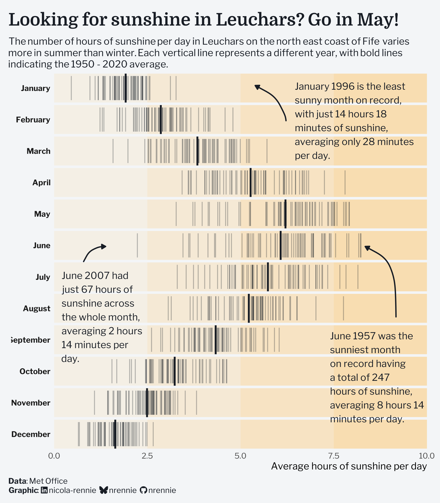
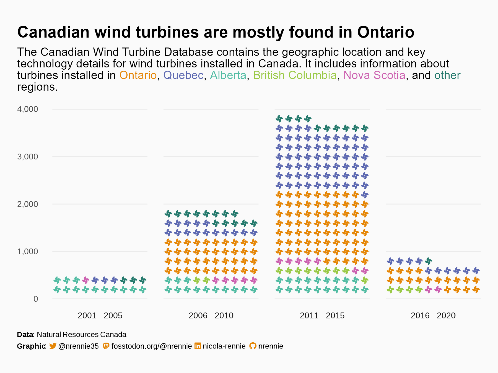
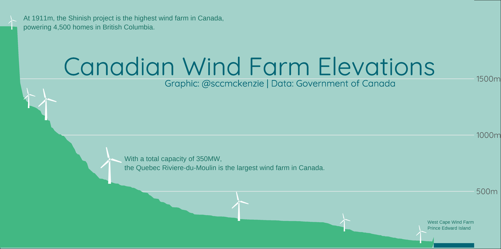
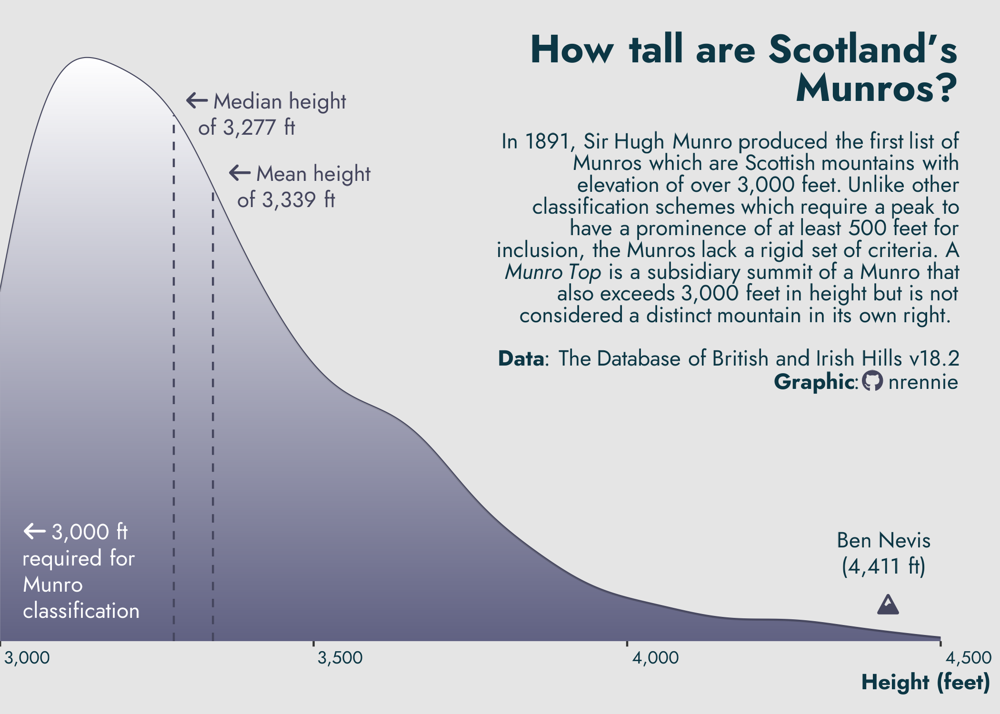
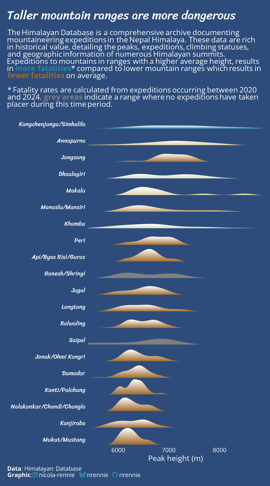
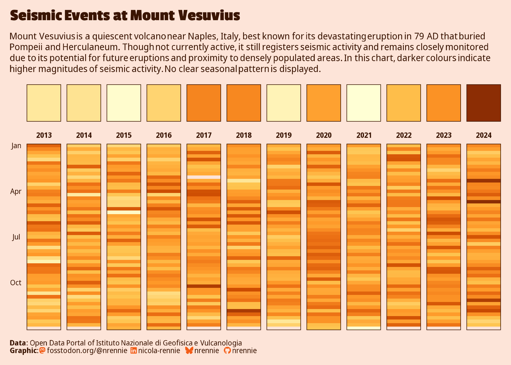

# TidyTuesday Reference: Climate & Site Morphology Visualization

**Visual gallery (actual images, not just links):** [Terrain & Climate Gallery](https://claude.ai/artifact/Y4kW8X3czEvrykTwbnDQm2) — the ten strongest examples below, as the real rendered chart images (downloaded from each contributor's GitHub repo), with credit and a source-code link on every card. Start there; this doc is the fuller written index behind it.

> **Local copy note:** this version embeds the reference images directly (`images/`) so it's self-contained in the repo. The hosted gallery link above remains the nicer interactive view (captions, credit, source links per card) when you have a browser handy.

Curated 2026-09-16 for the KED Site Assessment build (the local `_dev-siteAssessment` repo, R/ggplot2/terra/sf stack). Purpose: give the coding agent concrete, reproducible R examples — real code, not just inspiration images — for the illustration work described in `docs/ILLUSTRATION_NOTES.md` (regional/neighborhood/parcel scale) and `docs/WORKFLOW_SPEC.md` step 4/5.

**Why TidyTuesday specifically:** it's a weekly, all-R, fully-reproducible community challenge (rfordatascience/tidytuesday) — every entry below has real source code on GitHub, in the same ggplot2/sf/terra ecosystem KED already uses, which is exactly what a coding agent needs to study technique rather than just aesthetics.

**Existing style anchor, for context:** `docs/reference/dataViz_temp.jpg` is Cédric Scherer's *"Trends of Daily Temperatures for Selected Cities"* (data: University of Dayton) — a radial/polar small-multiples chart, one panel per city, each day plotted as a translucent point along a circular year-cycle, colored by temperature, panels sorted by latitude. It is **not** a TidyTuesday submission itself, but it's by one of TidyTuesday's most prominent contributors and sets the bar for the "editorial, muted, small-multiples, scientific-but-warm" register KED's `DESIGN_SYSTEM.md` is already chasing (cursor.com/insights reference, warm neutral palette pulled from the data itself). It's reproduced on the gallery page too, alongside its own community.

---

## 1. Climate visualizations

### Global Surface Temperature — TidyTuesday 2023-07-11

NASA GISTEMP v4 monthly temperature anomalies. [Gallery image](https://claude.ai/artifact/Y4kW8X3czEvrykTwbnDQm2) · [Nicola Rennie's source code](https://github.com/nrennie/tidytuesday/blob/main/2023/2023-07-11/20230711.R) — a radial year-ring chart, one ring per year, colored by deviation from the 1951–1980 baseline. [Dataset readme](https://github.com/rfordatascience/tidytuesday/blob/main/data/2023/2023-07-11/readme.md) · [round-up on R-bloggers](https://www.r-bloggers.com/2023/07/tidytuesday-week-28-global-surface-temperature/) (a second, animated-bar-chart treatment, fixed ±1.4°C viridis "turbo" scale)
- **Transfer to KED:** the fixed-scale-across-panels principle applies directly to any regional-vs-parcel climate comparison (e.g., PRISM normals) — don't let ggplot2's default per-panel scaling quietly change what "hot" means between two illustrations.

### US Droughts — TidyTuesday 2021-07-20 and 2022-06-14

U.S. Drought Monitor severity classifications by state/county, 2001–2021+. [Gallery image](https://claude.ai/artifact/Y4kW8X3czEvrykTwbnDQm2) · [Nicola Rennie's source code](https://github.com/nrennie/tidytuesday/blob/main/2022/2022-06-14/20220614.R) — geofaceted small multiples, one stacked-severity area per state, real US map layout. [2021 dataset readme](https://github.com/rfordatascience/tidytuesday/blob/main/data/2021/2021-07-20/readme.md)
- Direct topical match to a FEMA/NRCS-adjacent "risk category over time" problem — same shape as KED's flood-zone and erosion-threshold classifications (raw severity categories, not pre-collapsed labels — same "maintain raw field values" convention already in KED's `project_config.md`).

### Weather Forecast Accuracy — TidyTuesday 2022-12-20

[Gallery image](https://claude.ai/artifact/Y4kW8X3czEvrykTwbnDQm2) · [Nicola Rennie's source code](https://github.com/nrennie/tidytuesday/blob/main/2022/2022-12-20/20221220.R) — same geofacet-small-multiples device as US Droughts, applied to modeled-estimate-vs-observed. [Dataset readme](https://github.com/rfordatascience/tidytuesday/blob/main/data/2022/2022-12-20/readme.md)
- Useful pattern reference for any "modeled estimate vs. ground truth" framing KED might eventually need once field annotation (Layer 3 synthesis) is layered onto acquired data.

### Historic UK Meteorological & Climate Data — TidyTuesday 2025-10-21

[Gallery image](https://claude.ai/artifact/Y4kW8X3czEvrykTwbnDQm2) · [Nicola Rennie's source code](https://github.com/nrennie/tidytuesday/blob/main/2025/2025-10-21/20251021.R) — a strip-per-month rug plot, one thin rule per year, bold rule for the 70-year average. [Dataset readme](https://github.com/rfordatascience/tidytuesday/blob/main/data/2025/2025-10-21/readme.md)
- Long-run station climate normals shown as *distribution*, not just a mean — structurally close to PRISM/NOAA NCEI data KED already pulls, and directly on-topic for how KED could show a climate normal without hiding its spread.

### US / Canadian Wind Turbines — TidyTuesday 2018-11-06 and 2020-10-27

[Gallery images — isotype chart and terrain-elevation profile](https://claude.ai/artifact/Y4kW8X3czEvrykTwbnDQm2) · [Nicola Rennie's isotype/pictogram source](https://github.com/nrennie/tidytuesday/blob/main/2020/2020-10-27/20201027.R) · [@sccmckenzie's elevation-profile source](https://github.com/sccmckenzie/tidytuesday/blob/master/wind-turbines/wind-turbines.R)
- Direct topical overlap with KED's NOAA wind acquisition source. The @sccmckenzie piece is also the closest thing in the whole set to a literal terrain-elevation silhouette built from tabular (not DEM) data — worth a look purely for that device.

### "Escalating Drought" — Cédric Scherer × Georgios Karamanis, Scientific American (2021)
[Published piece](https://www.scientificamerican.com/article/climate-change-drives-escalating-drought/) · [Scherer's portfolio entry](https://www.cedricscherer.com/top/dataviz/)
- Not TidyTuesday, but the two most prominent TidyTuesday contributors, doing professional editorial climate cartography — the closest existing precedent to what a **client-facing, magazine-quality** KED climate section should look like, versus a community sketch. Worth a direct look for layout/typography discipline even without the source code being public.

### "Warming Stripes, Geofacet World" — Cédric Scherer (personal project, 2021)
[Portfolio entry](https://www.cedricscherer.com/top/dataviz/) — warming-stripe small multiples arranged in a geofacet grid (real relative geographic position, not alphabetical). The geofacet technique (via `{geofacet}`) is directly reusable for anything KED wants to show "this site in the context of many comparable sites," though it's a stretch for a single-parcel product; flag as a v2/portfolio idea, not a Phase 1 need.

---

## 2. Site morphology / terrain visualizations

### Scottish Munros — TidyTuesday 2025-08-19

Full list of Scotland's 282 Munro peaks (>3,000 ft). [Gallery image](https://claude.ai/artifact/Y4kW8X3czEvrykTwbnDQm2) · [Nicola Rennie's source code](https://github.com/nrennie/tidytuesday/blob/main/2025/2025-08-19/20250819.R) — a single elevation-density ridge with classification threshold, median, mean, and the tallest peak all annotated directly on the curve, no legend needed. A second, map-based treatment: [R-bloggers writeup](https://www.r-bloggers.com/2025/08/tidy-tuesday-looking-at-scottish-munros/) — `geom_sf` + real coastline/water linework, Brewer "Dark2" classification color, where the spatial clustering of the point data itself reveals the Great Glen Fault rather than plotting it directly.
- **Transfer:** a clean pattern for KED's slope/erosion-threshold graphics — annotate the real regulatory or NRCS threshold directly on the distribution, the way `parcel_slope_drainage.R`'s 20%-grade line could be. The map version is also a good "let the real data carry the geomorphology claim" precedent for KED's "verify before presenting" discipline.

### The History of Himalayan Mountaineering Expeditions — TidyTuesday 2025-01-21

[Gallery image — ridgeline by mountain range](https://claude.ai/artifact/Y4kW8X3czEvrykTwbnDQm2) · [Nicola Rennie's source code](https://github.com/nrennie/tidytuesday/blob/main/2025/2025-01-21/20250121.R) — peak-height distribution per range, colored by a derived risk metric (fatality rate), not raw height. [Dataset readme](https://github.com/rfordatascience/tidytuesday/blob/main/data/2025/2025-01-21/readme.md) · [Dan Oehm's alternate treatment](https://gradientdescending.com/tidy-tuesday-week-3-2025-himalayan-mountaineering-expeditions-%F0%9F%97%BB/) (image-composited bar chart, less directly transferable but a strong layout reference)
- **Transfer:** same move as KED's Graphic 2 (slope % as the encoded variable, not raw elevation) — derived risk/metric drives color, raw terrain drives shape.

### Seismic Events at Mount Vesuvius — TidyTuesday 2025-05-13

[Gallery image](https://claude.ai/artifact/Y4kW8X3czEvrykTwbnDQm2) · [Nicola Rennie's source code](https://github.com/nrennie/tidytuesday/blob/main/2025/2025-05-13/20250513.R) — two-tier calendar heatmap: `geom_tile()` annual-summary strip above a `geom_raster()` week-by-week grid, `facet_wrap(~year, nrow = 1)` across twelve years, one shared YlOrBr magnitude palette, fully custom warm/editorial theme via `patchwork` + `ggtext` + `showtext`.
- A second treatment worth knowing about even without an image here: **Johanie Fournier** — [writeup](https://www.johaniefournier.com/blog/tyt2025w19/) — animated point map, magnitude on color *and* size, `gganimate::shadow_mark()` accumulating a decade of events into one cumulative pattern.
- **Transfer:** a real worked example of tiling a derived-metric grid across a facet — directly applicable if KED ever needs a "years of drought/flood history at this site" summary view, and close in spirit to KED's DESIGN_SYSTEM.md warm-neutral approach.

### Canadian Wind Farm Elevations — TidyTuesday, Canadian Wind Turbine dataset (2020-10-27)
[Gallery image](https://claude.ai/artifact/Y4kW8X3czEvrykTwbnDQm2) · [@sccmckenzie's source code](https://github.com/sccmckenzie/tidytuesday/blob/master/wind-turbines/wind-turbines.R) — see Wind Turbines above; called out again here because it's the closest thing in this whole set to a literal elevation-profile illustration.

### Volcano Eruptions — TidyTuesday 2020-05-12
Smithsonian volcano database + ice-core sulfur/tree-ring climate-impact data. [Dataset readme](https://github.com/rfordatascience/tidytuesday/blob/main/data/2020/2020-05-12/readme.md) · [Cédric Scherer's entry](https://github.com/z3tt/TidyTuesday) (folder `plots/2020_20` — image not recoverable through the sources available this session, code is)
- Less directly transferable (KED doesn't handle volcanism) but structurally relevant: it's the TidyTuesday week that most resembles "one geological/geomorphic point-feature dataset, rendered against a world/regional basemap with a magnitude-coded marker" — the same shape as KED's building-footprint or flood-zone point/polygon overlays.

### San Francisco Street Trees — TidyTuesday 2020-01-28
[Alex Cookson's writeup + code](https://www.alexcookson.com/post/mapping-san-francisco-trees/) — small-multiples `facet_wrap` map, one panel per species, dark-green points at low alpha over a grey `geom_sf` road network, `theme_void()`.
- Directly relevant to KED's **deliberately-omitted parcel-scale canopy problem** (`ILLUSTRATION_NOTES.md` — NLCD is too coarse at parcel scale): a real worked example of point-level (not polygon-coverage) tree data at a scale where individual trees are resolvable, which is the resolution regime KED would need if it ever sources real tree-crown data instead of the 30m NLCD product.

### Washington Trails — TidyTuesday 2020-11-24
Trail-level elevation, length, and rating data. [CorrelAid gallery — 5 submissions, real images](https://tidytuesday.correlaid.org/2020-11-24/)
- The elevation-vs-rating scatter (highest elevation on y, colored by trail type, sized by trail length) is the closest existing analog to KED's own **Graphic 2 parcel illustration** (arrows scaled by slope %, labeled, `ggrepel`-placed) — same "derived terrain metric as the encoded variable, not raw elevation" move.

### Population Density in Africa (raster) — Georgios Karamanis, TidyTuesday 2021-45 / #30DayMapChallenge crossover
[Blog writeup, with images](https://karaman.is/blog/2021/11/tidytuesday-202145)
- Not a TidyTuesday *dataset* topic match, but a strong **technique** match: raster (not polygon) rendering of a continuous spatial variable, using `{scico}` perceptually-uniform palettes on a pseudo-log color scale to keep both subtle and extreme values legible in one image. Close to what KED's DEM/slope rasters need — continuous, wide-dynamic-range, single-frame.

---

## 3. Supplementary technique resources (not TidyTuesday, but directly stack-relevant)

These aren't community-challenge submissions, but they're the technique layer underneath several entries above and match KED's actual `terra`/`sf`/`ggplot2` acquisition stack closely enough to flag for the coding agent:

- **tidyterra hillshade series** (Diego Hernangómez) — [Hillshade, colors and marginal plots with tidyterra (I)](https://dieghernan.github.io/202210_tidyterra-hillshade/) — `terra` + `ggplot2` hillshade rendering, written by tidyterra's own author. Directly relevant to KED's parcel-scale DEM work (`R/illustrate/parcel_slope_drainage.R`) if hillshade ever gets revisited there.
- **Hillshade effects** (Dominic Royé) — [blog post](https://dominicroye.github.io/blog/hillshade-effect/index.html) — a second, independent worked hillshade example for cross-checking technique.
- **rayshader** (Tyler Morgan-Wall) — [GitHub](https://github.com/tylermorganwall/rayshader) — 2D/3D terrain rendering package; almost certainly overkill for KED's static-editorial direction, but worth knowing it exists if a 3D parcel view is ever requested.
- **Nicola Rennie, *The Art of Data Visualization with ggplot2: The TidyTuesday Cookbook*** — [publisher page](https://www.routledge.com/The-Art-of-Data-Visualization-with-ggplot2-The-TidyTuesday-Cookbook/Rennie/p/book/9781032766232) — a full book built specifically around TidyTuesday techniques in ggplot2. Notable in hindsight: her personal TidyTuesday repo (`github.com/nrennie/tidytuesday`) turned out to cover nearly every climate/terrain week in this document on its own — likely worth treating as a first stop for future searches, not just a book to acquire.

---

## 4. How to use this

For the coding agent: open the [gallery](https://claude.ai/artifact/Y4kW8X3czEvrykTwbnDQm2) first to see what each technique actually looks like, then follow that card's source-code link and read for the *technique* (scale discipline, palette choice, faceting strategy, annotation placement) rather than copying subject matter, since none of these are actually about site assessment. The closest structural analogs to KED's three illustration scales are:

- **Regional scale** (ecoregion + river context, `regional_inset.R`) → Scottish Munros' map treatment (`geom_sf` + real coastline/water linework + classification color) and the Georgios Karamanis Africa raster (continuous-variable, wide-dynamic-range single frame).
- **Neighborhood scale** (contours + hydrology + watershed, `neighborhood_context.R`) → SF Trees small-multiples-over-basemap pattern, and the tidyterra/Royé hillshade posts if raster terrain shading is ever reconsidered at this scale.
- **Parcel scale** (slope/drainage arrows, `parcel_slope_drainage.R`) → Washington Trails' elevation-as-encoded-variable scatter, Scottish Munros' threshold-annotated density ridge, and Nicola Rennie's Vesuvius two-tier tile/raster layering for any future "derived metric across a grid" graphic.
- **Climate normals** (not yet illustrated) → Global Surface Temperature's fixed-scale-across-panels discipline, the UK sunshine strip-plot's distribution-not-just-mean approach, and the Scherer×Karamanis Scientific American piece as the client-facing quality bar.

This doc is a starting index, not exhaustive — the TidyTuesday archive back to 2018 is large, and several adjacent weeks (soils, ecoregions specifically, watershed boundaries specifically) don't appear to have a direct TidyTuesday week at all. Re-search if a specific KED data source needs a closer analog than what's listed here.

---

## 5. Addendum: adapting these to the PRD's actual communication goal (2026-09-16)

Everything above was gathered against KED's *illustration* docs (`ILLUSTRATION_NOTES.md`, `WORKFLOW_SPEC.md`). Read against `docs/PRD.md` directly, the bar is narrower and more specific than "good climate/terrain chart": the report's job (PRD §1, §2, §5) is to make a **non-technical homeowner**, reading alone with no practitioner present, understand their own site's regional climate and hydrology *and* see what landscape design moves that behavior suggests — with the property itself as the visual anchor of every section, not one data point among many. PRD §12's principles are explicit: legibility over precision, ecological function over aesthetics, plain language required alongside every visualization, no raw technical indices in client content.

### The one transformation every example below needs

Every chart in this gallery is built to compare **many** things — many cities, many states, many mountains, many turbines. KED's report is built to situate **one** thing — this parcel — inside a pattern the homeowner recognizes. The recurring adaptation move is: keep the technique, drop the many-way comparison, and either (a) reduce the chart to the property's own single time series/distribution, styled the same way, or (b) keep the small-multiples/comparative device but make the property the one highlighted, labeled entry inside a light field of regional context (the way `regional_inset.R` already draws the parcel as a highlighted point against the ecoregion, not as an item in a list of parcels). A chart that still reads as "here's how sites in general behave" hasn't finished the adaptation — it needs to end on "here's what *your* site is doing."

### By PRD report section

**Regional Orientation** (ecoregion context, parcel highlighted) — already KED's strongest illustration (`regional_inset.R`). The Scottish Munros map ([gallery](https://claude.ai/artifact/Y4kW8X3czEvrykTwbnDQm2), R-bloggers writeup above) is the best precedent for extending it: real coastline/water linework plus a classification color that lets the *data's own spatial pattern* imply a geological story (the Great Glen Fault) instead of a callout box explaining it. Applied to KED: let the ecoregion boundary and river linework alone carry "you're in the Piedmont, here's what that means for water," and reserve the one annotation for the parcel marker itself.

**Topography and Landform** (hillshade, human-legible slope categories, aspect rose, elevation profile — PRD §5 names all four explicitly) — this section has the most direct hits in the set:
- *Slope categories, human-legible (flat/gentle/moderate/steep):* Scottish Munros' density ridge with the 3,000 ft classification threshold annotated on the curve is a ready-made template — swap the Munro threshold for KED's own flat/gentle/moderate/steep breakpoints (already established via the 20%-grade erosion threshold in `dem.R`'s `summarize_topography()`), and mark *this parcel's* slope value as a single labeled point on the curve rather than showing the whole distribution as data-for-data's-sake. That single point is what makes it about the client's yard instead of about slope in general.
- *Elevation profile:* the @sccmckenzie Canadian Wind Farm Elevations silhouette ([gallery](https://claude.ai/artifact/Y4kW8X3czEvrykTwbnDQm2)) is a literal terrain-profile device built from tabular data — adapt it as a street-to-back-fence cross-section through the parcel itself, and this is where "landscape design possibilities" can attach directly to topography: annotate a low point on the profile as "this dip collects runoff — a natural spot for a rain garden," not just as an elevation value.
- *Hillshade:* tidyterra's hillshade tutorial and Dominic Royé's independent version (§3 above) are the direct build references — both are `terra`+`ggplot2`, matching KED's stack exactly, and are more useful here than any TidyTuesday chart.
- *Aspect rose:* no example in this set does a rose diagram; the wind-rose adaptation below (Climate and Wind) is the closest structural analog — same `coord_polar` device, different variable.

**Hydrology and Drainage** (watershed context, flow direction, flood zone) — KED's `neighborhood_context.R` already does the core work (named river linework over abstract boundary shapes, per the real finding in `ILLUSTRATION_NOTES.md` that boundary polygons don't read as intuitive to laypeople). The one addition this set suggests: US Droughts' geofaceted small-multiples device ([gallery](https://claude.ai/artifact/Y4kW8X3czEvrykTwbnDQm2)) reduced to a single mini history band — not 50 states, just this site's own flood-zone/drainage-risk classification over the recorded period — would let "has this changed" sit next to the map without a second full chart.

**Climate and Wind** (seasonal bar charts, four-season layout, wind rose — PRD names these explicitly) — the strongest direct precedent already sits in `docs/reference/dataViz_temp.jpg` (the existing anchor): KED's own radial year-cycle device is the right shape for a *single property's* four-season normal, not a multi-city comparison. Two refinements this gallery adds:
- The **UK sunshine strip plot** ([gallery](https://claude.ai/artifact/Y4kW8X3czEvrykTwbnDQm2)) shows the full 70-year distribution per month, not just the mean line PRD's "seasonal bar chart" implies — worth considering instead of a bar, because it's more honest about variability (directly serves PRD §12's "transparency over authority") and supports a design-relevant plain-language line a bar chart can't: "in most recent Mays this site got at least this much rain — worth sizing a rain garden for a wet spring, not an average one."
- The **wind-turbine isotype chart** ([gallery](https://claude.ai/artifact/Y4kW8X3czEvrykTwbnDQm2)) suggests a plain-glyph alternative to a technical-looking polar wind rose for the seasonal wind diagram — small directional arrows/icons sized by frequency around a simplified compass read as "which way the summer breeze comes from" without requiring the reader to parse a polar axis. Worth prototyping against a standard `ggwindrose`-style rose (`climaemet::ggwindrose`, found during this research) before deciding.

**Soils and Infiltration** (isometric block diagram, soil profile, drainage-class table) — **gap**: nothing in this TidyTuesday-sourced set does an isometric block or a horizon-profile diagram; that's a soil-science/geotechnical illustration convention, not something the weekly-chart-challenge community tends to produce. Worth a separate, targeted search (USDA-NRCS soil survey manuals and SSURGO documentation are the more likely source of real conventions here) rather than forcing a TidyTuesday analog onto it.

**Microclimate** (plan-view heat accumulation map, canopy geometry, airflow) — this is the section where "landscape design possibilities" attaches most naturally to a single chart, and the **Himalayan ridgeline** pattern ([gallery](https://claude.ai/artifact/Y4kW8X3czEvrykTwbnDQm2)) is the right structural template even though the subject is unrelated: shape comes from raw terrain (aspect/hillshade), color comes from a *derived* risk/comfort metric (the heat-accumulation proxy), exactly as PRD §5 specifies. Georgios Karamanis' scico/pseudo-log raster technique (§2, §3 above) is the direct build reference for rendering that heat proxy as a continuous plan-view surface without letting a few extreme cells wash out the rest of the property. The plain-language sentence PRD §5 requires ("this section accumulates heat in summer due to [reason]") is also the natural place to name a design response — "consider shade trees or drought-tolerant planting here" — turning a data map into a design-possibility map with one added clause, not a second illustration.

**Vulnerabilities and Opportunities** (Layer 3 synthesis — practitioner voice, "the primary locus of ecological design guidance in the report" per PRD §3, illustration approach explicitly undecided per `WORKFLOW_SPEC.md`) — this is the one section without a data source of its own to visualize, so the gallery's techniques apply here only as *devices the practitioner's own annotated diagram could borrow*, not as auto-generated charts: the annotated-threshold-on-a-distribution move (Scottish Munros) and the annotated-elevation-profile move (Wind Farm Elevations) both generalize into "take a real KED site chart already built for an earlier section, and let the practitioner add one or two callouts naming a design opportunity directly on it," rather than inventing a new chart type for this section. That keeps the synthesis section visually grounded in the same data the client already saw, consistent with PRD §12's transparency principle, instead of introducing a new, unsourced graphic style at the point in the report doing the most persuasive work.

### One open tension worth flagging, not resolving here

PRD §6 names KED's established visual identity as **black-and-white primary, color used purposefully for data differentiation**, referencing kaleiope.design and existing print reports with ink-splash texture elements. `docs/DESIGN_SYSTEM.md` — the actual prototype work done so far — instead developed a warm-neutral, cursor.com/insights-inspired palette with an accent pulled from the data. Almost everything in this gallery (and the existing `dataViz_temp.jpg` anchor) reads as warm/colorful in the DESIGN_SYSTEM.md direction, not the PRD's stated black-and-white-primary direction. Adapting these techniques faithfully will mean either restyling their color use into a black/white + purposeful-accent system, or treating DESIGN_SYSTEM.md as a superseding decision — that's a call for Peter, not something to resolve by picking one silently.
